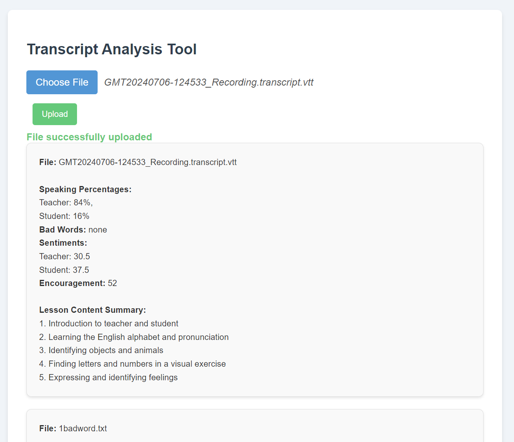

Here's the information formatted properly in markdown:





# VTT Transcript Analysis Tool

This tool analyzes VTT transcripts from tutoring classes, extracting data and performing specific analyses.

## Features

### Speaking Percentages
- Describes how long each speaker talks compared to the total speaking time.

### Bad Words
- Locates bad words said by the teacher using a "bad word" word bank.

### Sentiments
- Gives both participants a positivity score from 0-100.
  - 0: Extremely negative speech
  - 50: Neutral speech
  - 100: Extremely positive speech
- A sigmoid transformation is applied to disperse scores that were close to 50.

### Encouragement
- Shows how many encouraging words the teacher said, using an "encouragement" word bank.

### Lesson Content Summary
- Provides a list of 5 topics covered in the class using GPT3.5 API.
- **Note:** Requires API key

## How to Run

1. Install all dependencies.

2. Optionally set up an OpenAI key to get summaries. First, navigate to the API key page and "Create new secret key", optionally naming the key. Make sure to save this somewhere safe and do not share it with anyone. Second, Set up your API key here: https://platform.openai.com/docs/quickstart/step-2-set-up-your-api-key

3. Open split terminals.

4. On the first terminal, run the backend webserver:
   ```
   cd server
   if ($?) {
     cd myenv
     if ($?) {
       python server.py
     }
   }
   ```

5. On the second terminal, run the React frontend:
   ```
   npm start
   ```

6. Open `http://localhost:3000` in your browser, upload VTT files, and view the analysis.
